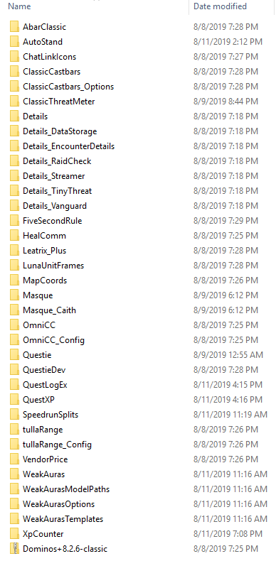

# Lavitz Addons, Macros, and Others' Weakauras

## Addons

*`LavitzAddonzV3.zip`* - My current pack of addons (Aug 11 2019 StressTest)

Does not contain a chat or bag addon. Maybe disable Luna Frames if it's your first time, all of the addons can be overwhelming at first.

Commands for addon anchors on a new character

- /abar lock|unlock
- /ctm lock|unlock
- /ltp lock|unlock
- /details hide|show

*Contents of pack:*



## Mage Macros

*Some macros credit to North*

### Open Macros!

`/macro`

### Addon Unlock and Addon Lock, for setting up the anchors on a new character.

```
/fsr unlock
/abar unlock
/ctm unlock
```

```
/fsr lock
/abar lock
/ctm lock
```

### Use Mana Gem

```
/script use("Mana Ruby")
/script use("Mana Citrine")
/script use("Mana Jade")
/script use("Mana Agate")
```

### Create Mana Gem
```
/script if not FindItem("Mana Ruby") then CastSpellByName("Conjure Mana Ruby") else if not FindItem("Mana Citrine") then CastSpellByName("Conjure Mana Citrine") else if not FindItem("Mana Jade") then CastSpellByName("Conjure Mana Jade") else if not FindIt
```

### Mana Shield Toggle

```
/run if nil then CastSpellByName("Mana Shield") end
/script if FindBuff("Mana Shield") then CancelBuff("Mana Shield") else CastSpellByName("Mana Shield") end
```

### Slow Fall Toggle

` /script if FindBuff("Slow Fall") then CancelBuff("Slow Fall") else CastSpellByName("Slow Fall") end `

### AP/Combust Trinkets

```
/script local start = GetActionCooldown(10) if ( start == 0 ) then cast("Arcane Power") end
/cast Combustion
/script use(13)
/script use(14)
```

### Stopcasting

`/script SpellStopCasting()`

### Delete Hearthstone and Unstuck

```
/run a,b=GetItemCooldown(6948)if a+b<GetTime()and GetItemCount(6948)>0 then print("\124cffff0000WARNING: USING HEARTHSTONE!\124r")PlaySoundFile("Sound\\creature\\Voljin\\VoljinAggro01.ogg")else PlaySound(8585)end
/click HelpFrameCharacterStuckStuck
```

### Accept Spirithealer Rez

```
/target spirit healer
/script SelectGossipAvailableQuest(1)
/script SelectGossipActiveQuest(1)
/script SelectGossipOption(1)
/run RepopMe()AcceptResurrect()AcceptXPLoss()
```

---

## Weakauras (Made by others)

### Max Camera Script

https://wago.io/Max-Camera
